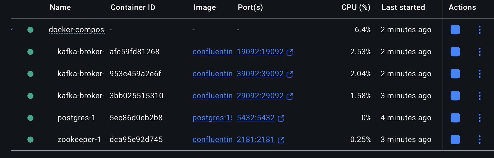

# financial_payment_processing

## Overview

This project implements distributed payment processing system designed to ingest payment orders, process payments with external providers under strict constraints, and provide reliable status tracking. The system is built using Java 21, Spring Boot, Kafka, and supports extensibility for multiple payment providers.

### Why 3 Microservices? — CQRS Implementation

The system is architected as three distinct microservices — 

- **Payment Command Service**  
- **Payment Dispatcher Service**  
- **Payment Query Service**

— to implement **CQRS (Command Query Responsibility Segregation)**, which separates the concerns of command processing (writes) from query handling (reads).

**Benefits of CQRS in this design:**

- **Separation of Concerns:**  
  The command service focuses exclusively on accepting and validating payment orders, ensuring they are durably stored and sent as events.

- **Optimized Processing:**  
  The dispatcher service handles the complexities of payment execution, including rate limiting, retries, and provider integration, without impacting query performance.

- **Scalable, Efficient Reads:**  
  The query service provides a lightweight, performant API to retrieve payment statuses, decoupled from the write-heavy workflows. This allows query models to be optimized independently.

- **Event-Driven Synchronization:**  
  Kafka topics facilitate asynchronous communication between services, propagating payment events to keep the query database in sync.

This design enhances scalability, maintainability, and resilience by clearly dividing responsibilities, aligning with best practices for complex distributed systems.

---

## Core Functional Requirements

1. **Ingest Payment Orders:**  
   Exposes a secure REST API to accept payment orders from client systems.

2. **Guarantee At-Least-Once Delivery:**  
   Uses Kafka for durable messaging to ensure every accepted payment is eventually processed.

3. **Global Rate Limits:**  
   Enforces a global maximum throughput of 2 transactions per second (2 TPS), regardless of service instances.

4. **Detect and Reject Duplicates:**  
   Implements idempotency with durable storage to prevent reprocessing of duplicate payments.

5. **Intelligent Retries:**  
   Uses exponential backoff retry strategy on transient provider failures, respecting the global rate limit.

6. **Expose Payment Status:**  
   Provides API endpoints to query payment status by payment ID.

7. **Provider Extensibility:**  
   Utilizes Strategy and Adapter patterns to allow easy addition of new payment providers without rewriting core logic.

8. **Emit Domain Events:**  
   Emits reliable payment completion or failure events to Kafka, ensuring downstream systems receive state updates.

---

## Project Structure



- **app-config-data:** Centralized configuration data models shared across services.  
- **config_server:** Spring Cloud Config Server providing externalized configuration.  
- **config_server_repository:** Repository containing service configuration files for config server.  
- **docker_compose:** Docker Compose files for orchestrating Kafka, database, and other infrastructure.  
- **kafka:** Kafka related modules:  
  - `kafka-producer`: Producer implementations for Kafka topics.  
  - `kafka-consumer`: Consumer implementations for Kafka topics.  
- **payment-command-service:** API gateway and payment ingestion service.  
- **payment-dispatcher-service:** Service responsible for consuming payment orders, invoking payment providers, retrying, and emitting domain events.  
- **payment-query-service:** Service exposing APIs for querying payment status.

## Docker



1. **Clone the repository**

   ```bash
   git clone https://github.com/chacha1921/financial_payment_processing.git
   cd payment-processing-gateway
docker compose -f common.yml -f kafka_cluster.yml -f postgres_cluster.yml up

POST /payments — Submit new payment orders

GET /payments/{paymentId} — Query payment status


## Solutions to Core Functional Requirements

### 1. Ingest Payment Orders  
- **Solution:**  
  The **payment-command-service** exposes a secure and well-designed REST API built with Spring Boot. This API validates incoming payment orders and ensures only authorized clients can submit them.

### 2. Guarantee At-Least-Once Delivery  
- **Solution:**  
  Payment orders are published to Kafka topics, providing durable message storage. The **payment-dispatcher-service** consumes these messages and processes payments reliably. Kafka’s persistence guarantees that messages are not lost and are retried if processing fails or the service restarts.


### 3. Detect and Reject Duplicates  
- **Solution:**  
  Idempotency is achieved using the payment ID as a unique key stored in a relational database (such as PostgreSQL). Before processing, the **payment-dispatcher-service** verifies if the payment has already been handled. Unique constraints and checks prevent duplicate processing, surviving across service restarts and retries.

### 4. Implement Intelligent Retries  
- **Solution:**  
  The system retries failed payment attempts intelligently with exponential backoff when transient errors or timeouts occur. These retries respect the global 2 TPS rate limit, ensuring robustness without violating provider constraints.

### 5. Expose Payment Status  
- **Solution:**  
  The **payment-query-service** offers a REST API endpoint allowing clients to query the status of any payment by its payment ID. This service reads from the durable payment state stored in the database, reflecting real-time status updates.


### 6. Emit Domain Events  
- **Solution:**  
  Upon payment completion or failure, the **payment-dispatcher-service** publishes domain events to Kafka topics. This is done reliably using the transactional outbox pattern, ensuring that event emission is consistent with state changes and preventing loss of critical notifications for downstream systems.


  Future Implementation Due to time constraint

### 7. Adhere to Global Rate Limits (2 TPS)  
- **Solution:**  
  A distributed rate limiter enforces the external provider's global throughput limit of 2 transactions per second. This limiter (e.g., implemented via Redis or a centralized token bucket) coordinates across all service instances to prevent exceeding this limit, ensuring compliance even in a scaled environment.

### 8. Facilitate Provider Extensibility  
- **Solution:**  
  The architecture employs the Strategy and Adapter patterns to abstract payment provider integrations. Adding new providers requires implementing a common interface without altering the core ingestion or processing logic, promoting maintainability and extensibility.


